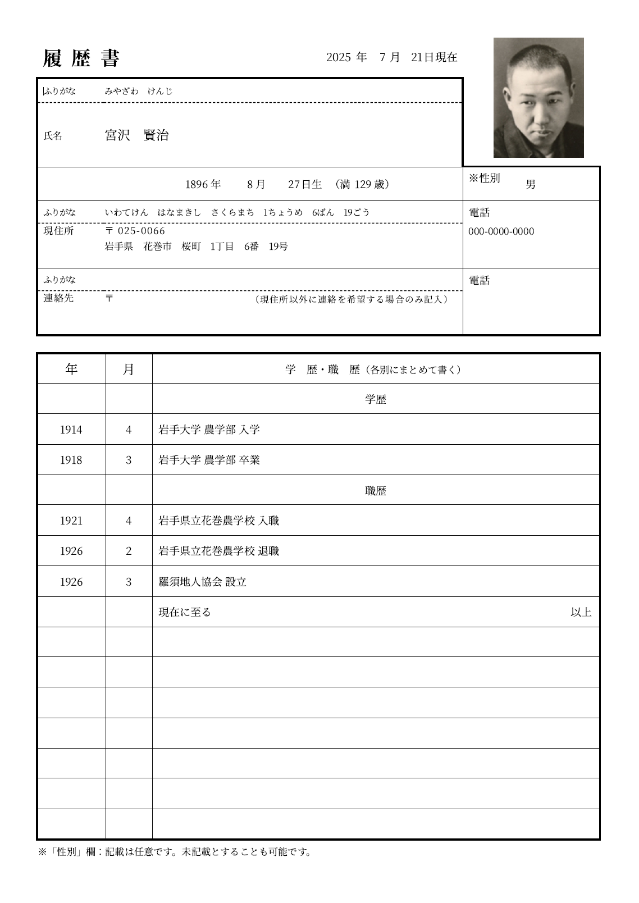
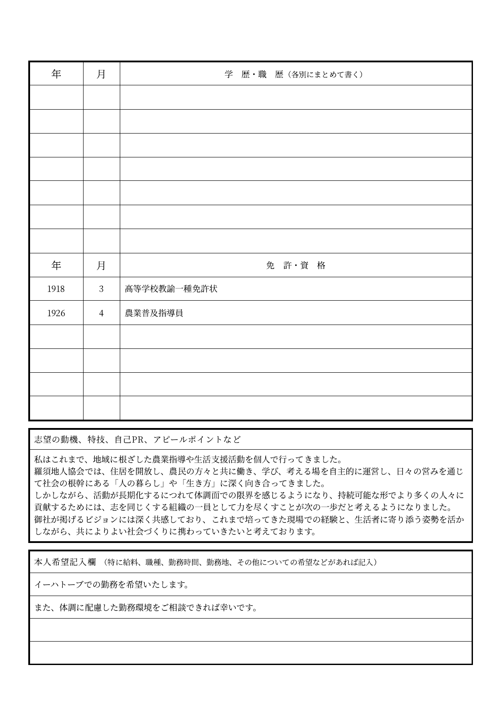
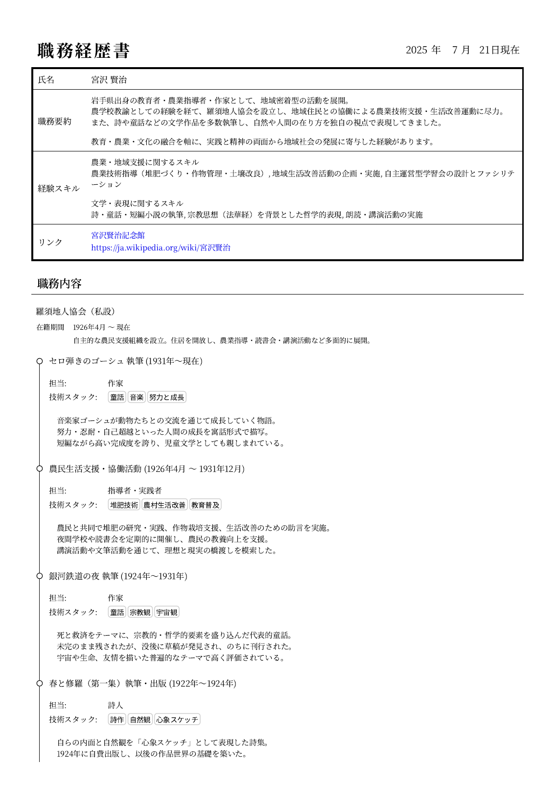
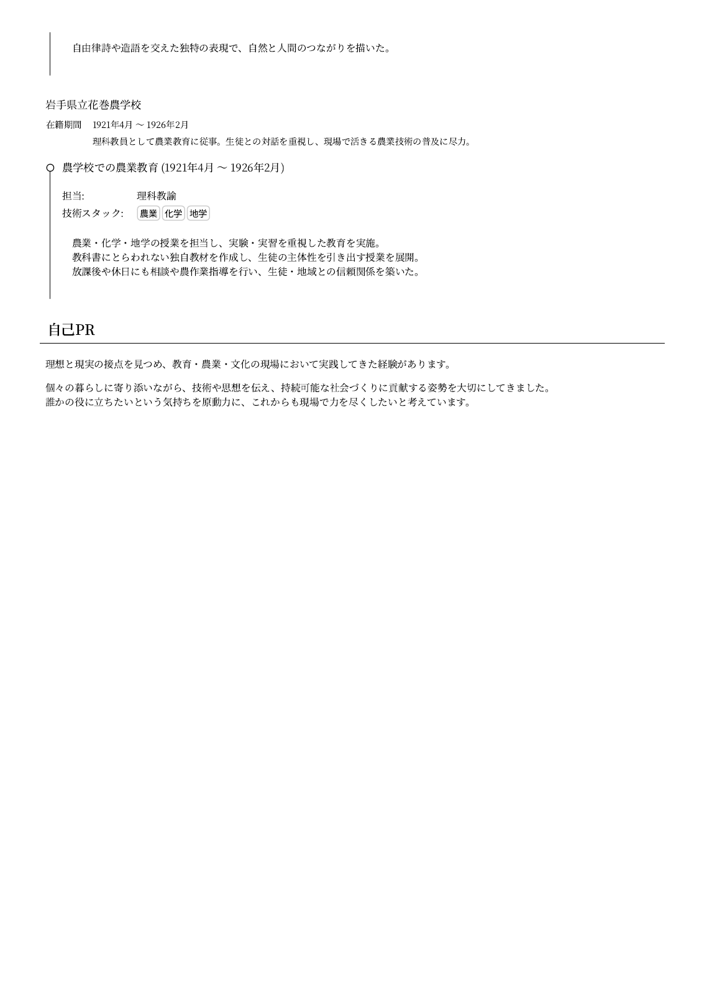

resume generator
====================================================================================================

Generate resume (Japanese Ministry of Health, Labour and Welfare format) and
career history (for IT engineer) from preferences in TOML file.


Requirements
----------------------------------------------------------------------------------------------------

- Node.js 22


How to build
----------------------------------------------------------------------------------------------------

Describe your resume and career history to TOML files in `data` directory.

Build resume and career history, and pdf files will be created in the `out` directory.

```bash
npm install

npm run build

ls out
```


How to debug
----------------------------------------------------------------------------------------------------

Enabling debug mode will output resolved parameters to console and
additionally generate html version that serves as basis for pdf.

```bash
RESUME_DEBUG=1 npm run build
```


Options
----------------------------------------------------------------------------------------------------

Some settings can be customised via environment variables or `config.js` file.


Examples
----------------------------------------------------------------------------------------------------

### Resume

<a href=".doc/resume-example-1.png">

</a>
<a href=".doc/resume-example-2.png">

</a>

### Career history

<a href=".doc/career-history-example-1.png">

</a>
<a href=".doc/career-history-example-2.png">

</a>
