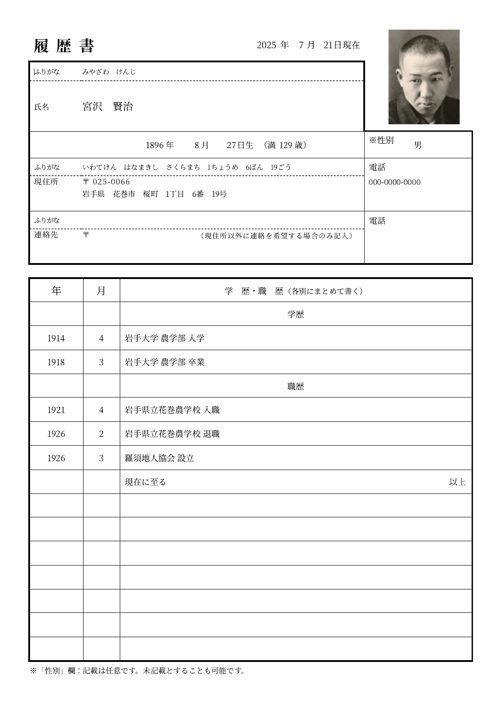
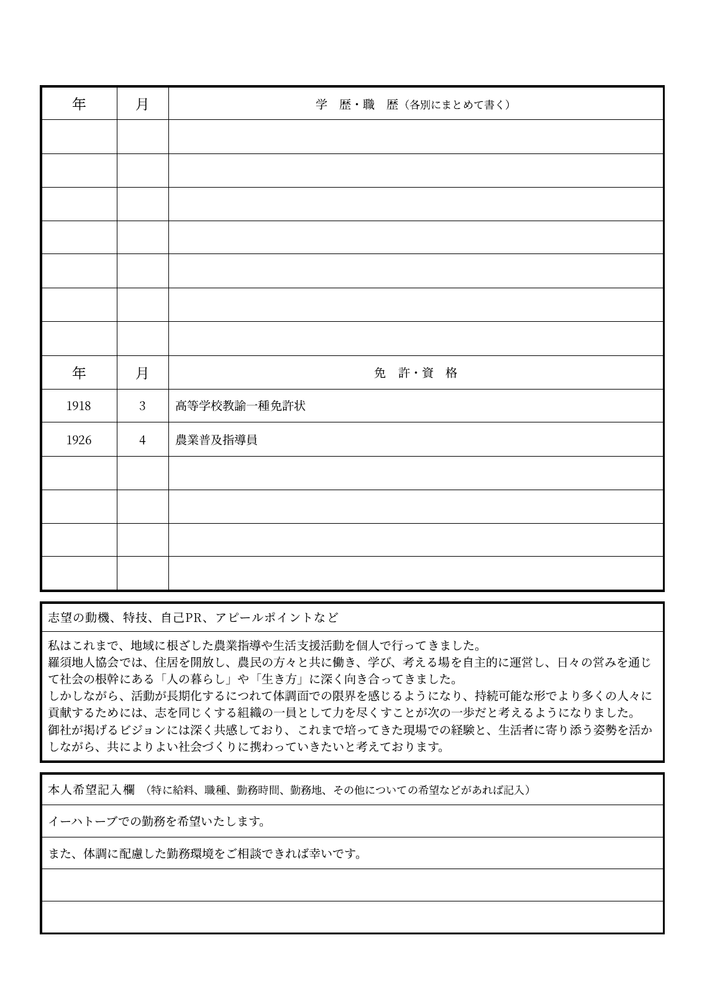
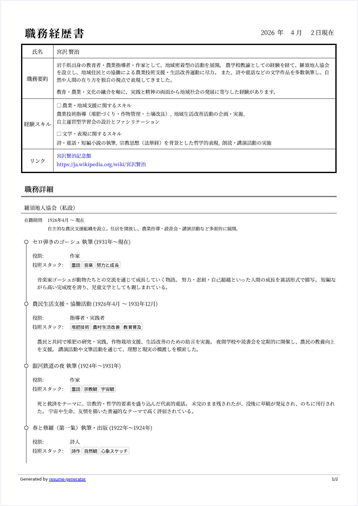
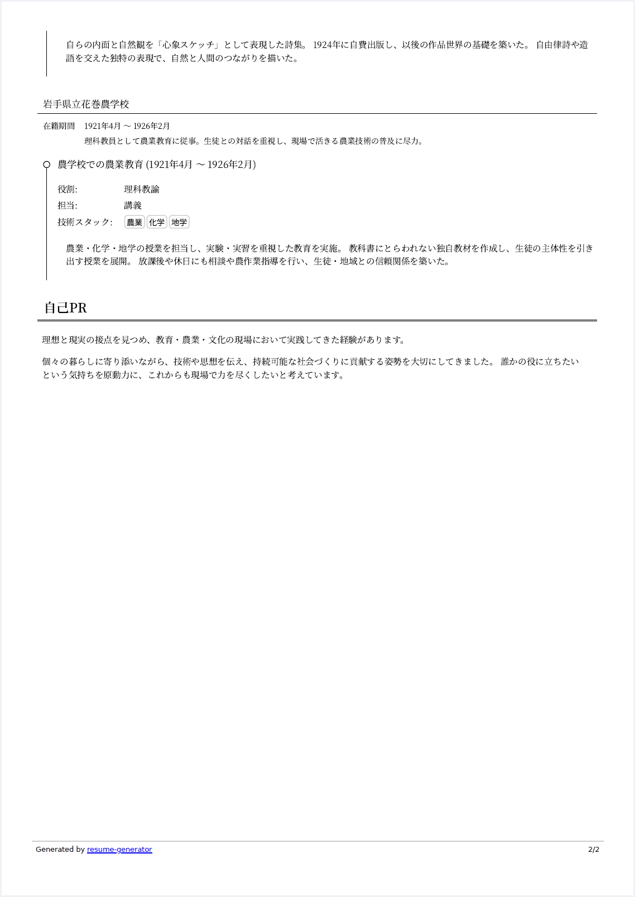

resume generator
====================================================================================================

Generate resume (Japanese Ministry of Health, Labour and Welfare format) and
career history (for IT engineer) from preferences in TOML file.


Requirements
----------------------------------------------------------------------------------------------------

- Node.js 22


How to build
----------------------------------------------------------------------------------------------------

Describe your resume and career history to TOML files in `data` directory.

Build resume and career history, and pdf files will be created in the `out` directory.

```bash
npm install
npm run build

ls out
```


How to config
----------------------------------------------------------------------------------------------------

Some settings can be customised via environment variables or `config.js` file.

When removing the text "Generated by resume-generator",
edit the `footerTemplate` in `config.js`.

```
<span>Generated by </span><a href="https://github.com/yo1000/resume-generator">resume-generator</a>
```

When configuring via environment variables,
use the prefix `RESUME__`
and name them by separating the JSON hierarchy with `__`
and individual words with `_`.

For example,
to set `out.careerHistoryBaseName` via an environment variable,
use `RESUME__OUT__CAREER_HISTORY_BASE_NAME`.

```bash
RESUME__OUT__RESUME_BASE_NAME="履歴書" \
RESUME__OUT__CAREER_HISTORY_BASE_NAME="職務経歴書" \
RESUME__OUT__WITH_PROFILE_NAME=true \
npm run build
```


How to debug
----------------------------------------------------------------------------------------------------

Enabling debug mode will output resolved parameters to console and
additionally generate html version that serves as basis for pdf.

```bash
RESUME__DEBUG=1 npm run build
```


Examples
----------------------------------------------------------------------------------------------------

### Resume

<a href=".doc/resume-example-1.png">

</a>
<a href=".doc/resume-example-2.png">

</a>

### Career history

<a href=".doc/career-history-example-1.png">

</a>
<a href=".doc/career-history-example-2.png">

</a>
